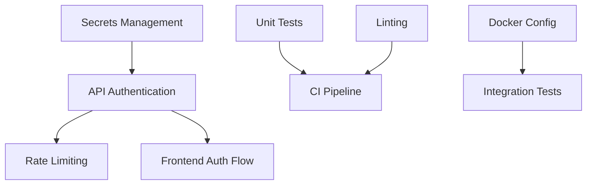

# Feature Landscape

**Domain:** Personal Search / Knowledge Management
**Focus:** Security, CI/CD, Quality Assurance
**Researched:** 2026-02-07

## Table Stakes

Features users and developers expect for a robust, production-ready application.

| Feature | Why Expected | Complexity | Notes |
|---------|--------------|------------|-------|
| **API Authentication** | Protects personal data; prevents unauthorized indexing/searching. | Medium | OAuth2 with JWT (FastAPI standard) or API Keys. |
| **Secrets Management** | Prevents credential leaks; essential for security. | Low | Use `.env` files with `pydantic-settings`. Never commit secrets. |
| **CORS Configuration** | Required for Frontend (5173) to talk to Backend (8000). | Low | Configure FastAPI `CORSMiddleware` explicitly. |
| **Automated Linting** | Ensures code quality; catches bugs early. | Low | Python: `ruff`. JS: `eslint`. Run on commit. |
| **Unit Testing Pipeline** | Verifies logic stability during refactors. | Medium | Python: `pytest`. JS: `vitest`. |
| **CI Workflow** | Enforces quality gates before merge. | Medium | GitHub Actions: Run tests + lint on push/PR. |
| **Input Validation** | Prevents injection/malformed data. | Low | Enforced via Pydantic models. |
| **Full-Text Search** | (Existing) Basic keyword matching baseline. | Medium | SQLite FTS5 / LanceDB. |
| **Ingest API** | (Existing) Mechanism to save content. | Low | REST endpoint receiving JSON/HTML. |

## Differentiators

Features that improve Developer Experience (DX) and security posture beyond the basics.

| Feature | Value Proposition | Complexity | Notes |
|---------|-------------------|------------|-------|
| **Pre-commit Hooks** | Catches issues *before* CI runs, saving feedback time. | Low | `pre-commit` framework for Python/JS. |
| **Audit Logging** | Tracks "who searched/deleted what". | Medium | Critical for security; debugging aid. |
| **Rate Limiting** | Prevents abuse/brute-force on auth endpoints. | Medium | `slowapi` middleware for FastAPI. |
| **Integration Testing in CI** | Validates full stack (DB + API) together. | High | Requires Docker services in GitHub Actions. |
| **Dependency Scanning** | Alerts on vulnerable libraries automatically. | Low | GitHub Dependabot or `pip-audit`. |
| **Local-Only Privacy** | "My data never leaves my machine" (Architecture). | N/A | Major selling point vs cloud tools. |

## Anti-Features

Features to explicitly NOT build for this phase/scale.

| Anti-Feature | Why Avoid | What to Do Instead |
|--------------|-----------|-------------------|
| **Complex IdP (Auth0/Okta)** | Overkill for single-user/personal tool. | Use built-in FastAPI OAuth2 (self-hosted). |
| **Kubernetes/Helm** | Too complex for single-node deployment. | Use Docker Compose. |
| **Microservices Auth (mTLS)** | Unnecessary complexity for monolithic app. | Trusted network or shared secret. |
| **User Management UI** | Distraction from core value. | Manage initial users via CLI/Script. |
| **Cloud Sync (MVP)** | Privacy risks, high complexity. | Focus on robust local storage first. |

## Feature Dependencies

## MVP Recommendation

For the **Security & CI/CD Milestone**, prioritize:

1.  **Secrets Management**: Implement `pydantic-settings` to load config/secrets safely.
2.  **API Authentication**: Implement simple FastAPI JWT Bearer auth to protect `/search` and `/ingest`.
3.  **Basic CI Pipeline**: Create `.github/workflows/test.yml` running `pytest` and `eslint`.
4.  **CORS**: Strict allow-list for UI development.

**Defer:**
-   Rate limiting (unless exposed to public).
-   Audit logging (add when multi-user support is needed).
-   Complex UI for login (basic form is enough).

## Sources
-   [FastAPI Security Docs](https://fastapi.tiangolo.com/tutorial/security/)
-   [GitHub Actions Python Starter](https://docs.github.com/en/actions/automating-builds-and-tests/building-and-testing-python)
-   [OWASP Top 10 API Security](https://owasp.org/www-project-api-security/)
